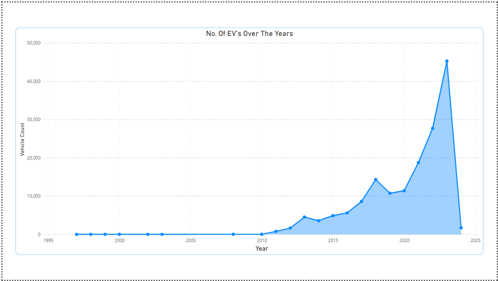

# Electric Vehicle Dataset - United States (WA Majority)

Explore a comprehensive dataset on electric vehicles (EVs) with detailed information on key attributes. This dataset encompasses a range of factors, providing valuable insights into the electric vehicle landscape. Here are the key columns:

## Columns

- **City:** The city where the vehicle is located.
- **State:** The state where the vehicle is registered.
- **Model Year:** The year of the vehicle model.
- **Make:** The make of the vehicle.
- **Model:** The model of the vehicle.
- **Electric Vehicle Type:** Type of electric vehicle (e.g., PHEV, BEV).
- **CAFV Eligibility:** Clean Alternative Fuel Vehicle eligibility status.
- **Electric Range:** The electric range of the vehicle.
- **Base MSRP:** The Manufacturer's Suggested Retail Price.
- **Electric Utility:** The electric utility associated with the vehicle.

## Dataset Overview

Gain insights into the electric vehicle market by exploring this dataset. Understand the distribution of EV types, eligibility status, electric ranges, and more.

## Screenshots

1. Type Of EV Sold
   

2. Market Share By Company
   

3. No Of EV Sold
   

4. Final Dashboard
   

## Kaggle Dataset Link

Access the dataset on Kaggle: [Electric Vehicle Dataset](https://www.kaggle.com/datasets/adilashrafi/elecrict-vehicle)

## Using the Dataset

Feel free to clone the repository and leverage the dataset for your analyses, visualizations, or research. Use the columns to filter and explore specific aspects of electric vehicles that interest you.
